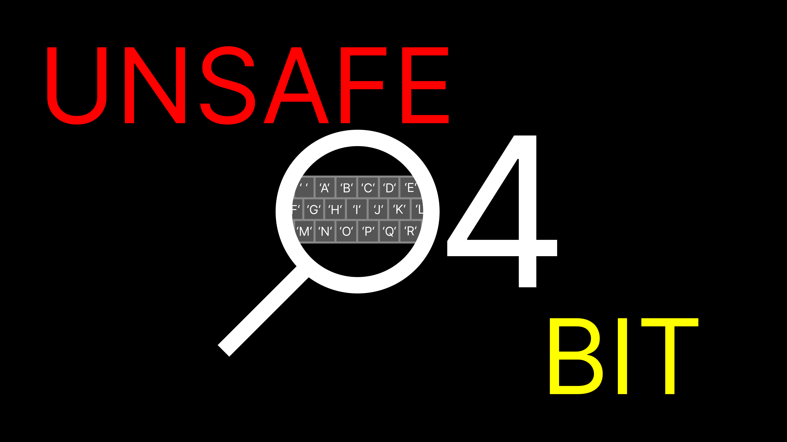

**`Unsafe Four Bit`** is a

- *fast-paced*
- compiled-interpreted
- dynamically-typed
- imperative-procedural
- programming language on top of another programming language.

---

UFB is *"kind of"* similar to its lower-level counterparts because it tries to manage its memory even if it technically does not.

With UFB- you can manage your 1-by-256 byte memory tape.

The freedom of using the non-ROM 218 bytes gives you the ability to shoot yourself in the foot like how you would manually manage memory in lower-level languages.

---

The built-in ROM includes the space literal,

capital A-to-Z, numbers from 0 to 9, and the linefeed.

UFB includes [16 default commands](./EXAMPLES/README.md#default-16).

---

Write your first program full of commands,

get disgusted by the colored warning and error messages,

and [compile](./UFBC/UFBC.java) and [run](./UFB/UFB.java) the program!
