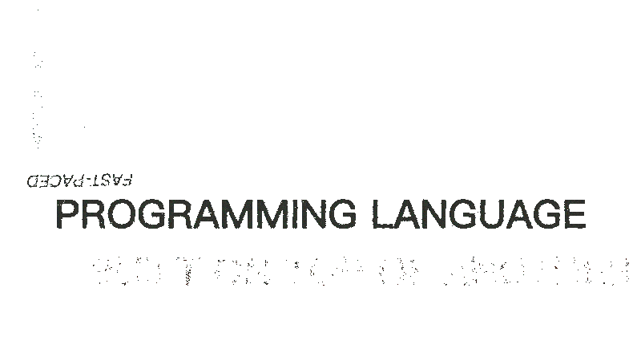

<div align="center">

[]()
[]()
[]()
[]()

---

[](./.github/ShortenedBanner.png)

[](./.github/UFBDesc.apng)
---

> Unsafe Four Bit / UFB / Unsafe-4-Bit is a fast-paced, compiled-interpreted, dynamically-typed, imperative-procedural programming language built with Rust.

---

UFB reminds you of its ***lower-level counterparts*** as you manage your ***"RAM"***.

The [256 items in memory](https://github.com/JumperBot/Unsafe-4-Bit/wiki/Z-Others#Memory) is divided into two parts: ROM and non-ROM.

This ***"freedom"*** lets you ***"shoot yourself in the foot"***.

</div>

---

<div align="center">

# :heavy_plus_sign: Installation :arrow_down:

Download the ***latest*** binary:

https://github.com/JumperBot/Unsafe-4-Bit/raw/master/build/ufb

Or clone the repository and get continous updates:

```bash
git clone https://github.com/JumperBot/Unsafe-4-Bit.git
```

</div>

---

<div align="center">

# :construction: Contributing :construction_worker:

> Good at **designing** homepages?

Try *redesigining* this README!

---

> You think that the code is ***slow***?

*Reconstruct* the code and open a [pull request](https://github.com/JumperBot/Unsafe-4-Bit/compare)!

---

> Want a **new feature** to be added?

*Submit* an [issue](https://github.com/JumperBot/Unsafe-4-Bit/issues/new/choose) or *code* it yourself!

---

> Want to help in another way?

***Star*** the repository!

</div>

---

<div align="center">

# :technologist: Tutorial :monocle_face:

Write your first program full of [commands](https://github.com/JumperBot/Unsafe-4-Bit/wiki/Z-Others#default-16), warnings and errors...

and [compile](https://github.com/JumperBot/Unsafe-4-Bit/wiki/The-Compiler) and [run](https://github.com/JumperBot/Unsafe-4-Bit/wiki/The-Interpreter) the program!

</div>

---

```python
// This program creates an endless background of "Hello World"s.

/*
Write "Hello World" to memory index: 38
*/
wvar  38  "Hello World"
// Print the variable residing in memory index: 38
print 38
/* Jump to command no. 0
   if the values in memory indexes 0 and 0 are equal */
je    0  0  0
// Empty out memory index 38 to avoid memory leakage
nvar  38
```
